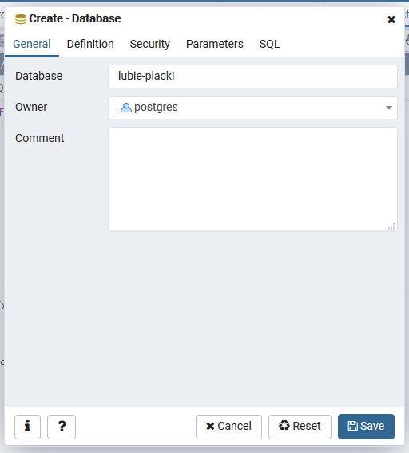
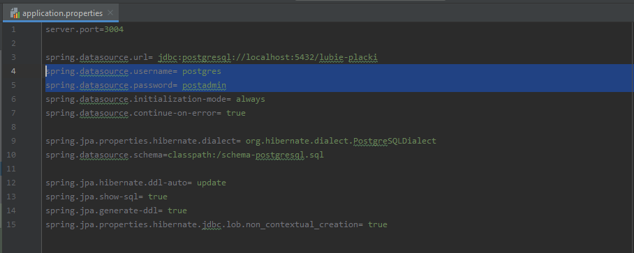
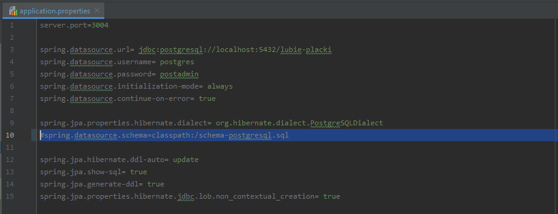
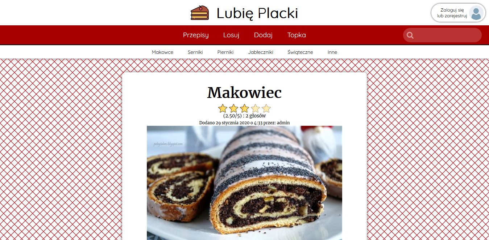

# Lubię Placki 
Serwis do dzielenia się przepisami na ciasta

## Jak otworzyć?

Otwarcie serwisu składa się z trzech części:
- utworzenie bazy danych
- uruchomienie serwera
- uruchomienie strony

### Utworzenie bazy danych
`(pgAdmin 4)`

Baza danych została stworzona na platformie PostgreSQL. Jeśli nie masz tego systemu, możesz go pobrać [TUTAJ](https://www.postgresql.org/download/)

Używamy programu *pgAdmin 4*. Tworzymy nową bazę danych i nazywamy ją "*lubie-placki*"

Podczas uruchomienia serwera tabele zostaną utworzone automatycznie.

### Uruchomienie serwera
`(IntelliJ)`

Otwieramy folder *lubie-placki/backend*:

W pliku *application.properties* w folderze *resources* zmieniamy nazwę użytkownika i hasło na to, które używamy korzystając z *pgAdmin 4*:

Przy okazji warto wspomnieć, że z każdym uruchomieniem serwera, baza danych zostania stworzona na nowo, a wprowadzone przez nas zmiany (np. dodanie przepisu) zostaną usunięte. Aby tego uniknąć, po pierwszym uruchomieniu serwera (po uruchomieniu, żeby baza dazych się zainicjowała!) warto zakomentować linię z adresem do bazy danych. Znakiem komentarza jest `#`.

Aby uruchomić serwer klikamy prawym przyciskiem myszy na plik *LubiePlackiBackendApplication* w drzewie projektu i wybieramy opcję *Run...*:

### Uruchomienie strony
`(Visual Studio Code)`

Otwieramy folder *lubie-placki*

Włączamy terminal (można utworzyć skrótu klawiszowego `` Ctrl + ` ``  ).

W terminalu wpisujemy `npm install`, by zainstalować wszystkie dependencje, a następnie `npm start`, by włączyć projekt

Ostatecznie możemy cieszyć się naszą piękną stroną :)

